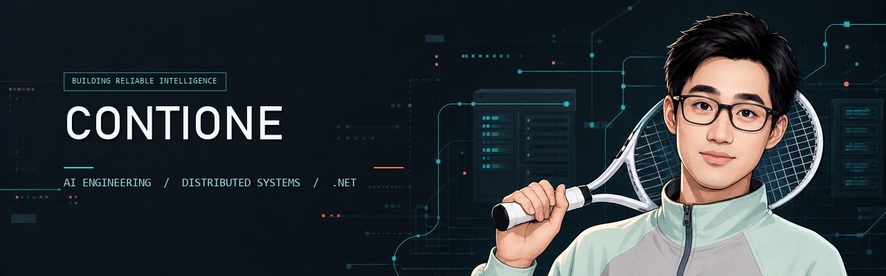

<p align="center">
  
</p>

<p align="center">
  <a href="https://www.contione.cn"></a>
  
  
  
</p>

<h3 align="center">Building reliable systems where AI, data, and software architecture meet.</h3>

<p align="center">
  Focused on AI agents, distributed .NET systems, workflow engines, and developer tooling.<br />
  Turning complex infrastructure into small, explicit, and replaceable building blocks.
</p>

## Current focus

<p align="center">
  
</p>

## Toolbox

<p>
  
</p>

<p>
  <a href="https://aws.amazon.com/eks/"></a>
  <a href="https://azure.microsoft.com/products/kubernetes-service"></a>
  <a href="https://github.com/anthropics/claude-code"></a>
  <a href="https://github.com/openai/codex"></a>
  <a href="https://github.com/badlogic/pi-mono"></a>
  <a href="https://github.com/mpfaffenberger/code_puppy"></a>
</p>

```csharp
public sealed record EngineeringStyle(
    bool ClearBoundaries = true,
    bool ObservableBehavior = true,
    bool ReplaceableInfrastructure = true,
    bool ProductionBeforeDemo = true);
```

<p align="center">
  <a href="https://github.com/contione?tab=repositories">Explore repositories</a>
  &nbsp;&middot;&nbsp;
  <a href="https://www.contione.cn">Read notes</a>
</p>
